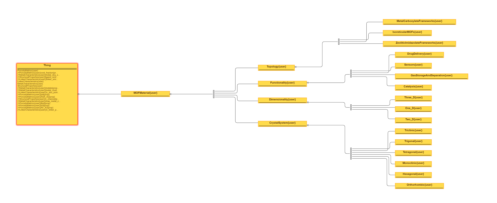

# MOFO: MOF Ontology Generation

  

## Overview
MOFO is dedicated to the development and dissemination of a standardized ontology for Metal-Organic Frameworks (MOFs). This initiative aims to facilitate enhanced data sharing and interoperability among researchers in the field of material science.

### MOFO2 Ontology Details

*The image above depicts the detailed classes and properties of the MOFO ontology. It focuses on the specific attributes and relationships within MOFs, such as porosity, linker characteristics, and metal site attributes, providing a structured view that supports advanced data analysis and research.*

## Repository Content
- `Ontology/`: Contains the MOF ontology files.
- `Scripts/`: Includes all scripts used for data processing and ontology manipulation.
- `Docs/`: Detailed documentation on the usage and structure of the MOF ontology.

